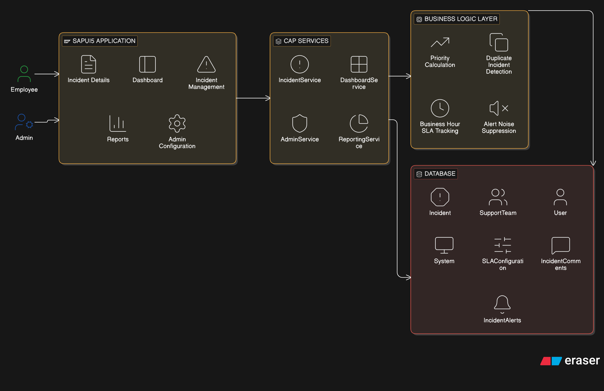
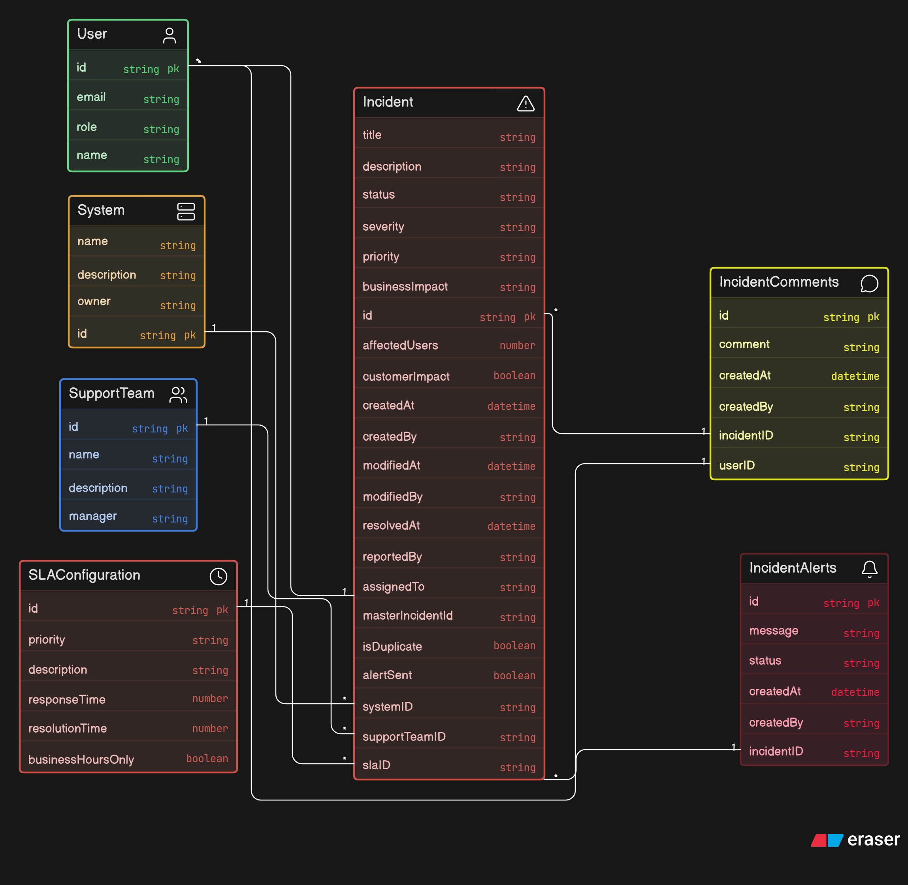

# Incident Monitoring Dashboard

## Overview

The Incident Monitoring Dashboard is a centralized application developed using SAP CAP (Node.js), SAP HANA, and SAPUI5. The application enables enterprise support teams to monitor, manage, prioritize, and resolve incidents across multiple business systems and interfaces.

The solution provides dashboards, reporting, SLA monitoring, duplicate incident detection, alert management, and incident lifecycle tracking.

---

# Business Problem

Enterprise support teams often receive incidents from multiple systems such as SAP S/4HANA, SAP CPI, SuccessFactors, and other enterprise applications.

Without a centralized solution:

* Incidents are difficult to track.
* SLA compliance becomes challenging.
* Duplicate incidents create operational noise.
* Reporting and trend analysis are limited.
* Critical incidents may not receive timely attention.

The Incident Monitoring Dashboard addresses these challenges by providing a single platform for incident monitoring and management.

---

# Users and Roles

## Employee

Responsibilities:

* Create incidents
* View own incidents
* Track incident status
* Add comments
* Verify resolutions

### Employee Features

* Create Incident
* My Incidents
* Incident Details
* Comments

---

## Admin

Responsibilities:

* Monitor all incidents
* Assign support teams
* Manage SLA configurations
* Manage systems
* Generate reports
* Monitor dashboards

### Admin Features

* Incident Management
* Dashboard
* Reports
* SLA Configuration
* Support Team Management
* System Management

---

# Architecture Diagram

---

# Entity Relationship Diagram (ERD)

---

# Core Entities

## User

Stores application users and their roles.

Attributes:

* ID
* Name
* Email
* Role

---

## Support Team

Represents support groups responsible for incident resolution.

Examples:

* CPI Team
* Basis Team
* SuccessFactors Team

Attributes:

* ID
* Name
* Description
* Manager

---

## System

Represents business applications where incidents occur.

Examples:

* SAP S/4HANA
* SAP CPI
* SAP SuccessFactors

Attributes:

* ID
* Name
* Description
* Owner

---

## SLA Configuration

Defines response and resolution timelines.

Attributes:

* Priority
* Response Time
* Resolution Time
* Business Hours Only

---

## Incident

Main business entity representing support incidents.

Attributes:

* Title
* Description
* Status
* Severity
* Priority
* Business Impact
* Affected Users
* Customer Impact
* Reported By
* Support Team
* System
* SLA

---

## Incident Comments

Stores comments and updates related to incidents.

---

## Incident Alerts

Stores generated alerts for incidents.

---

# Incident Lifecycle

New

↓

Open

↓

Assigned

↓

In Progress

↓

Resolved

↓

Closed

---

# Business Rules

## 1. Dynamic Priority Calculation

Priority is automatically determined based on:

* Severity
* Business Impact
* Number of Affected Users
* Customer Impact

Example:

| Severity | Affected Users | Customer Impact | Priority |
| -------- | -------------- | --------------- | -------- |
| Critical | High           | Yes             | P1       |
| High     | Medium         | No              | P2       |
| Medium   | Low            | No              | P3       |

---

## 2. Duplicate Incident Detection

The system should identify duplicate incidents.

Conditions:

* Same System
* Similar Error Description
* Within Configured Time Window

When detected:

* Mark Incident as Duplicate
* Link to Master Incident

---

## 3. Alert Noise Suppression

Critical alerts should only be generated if the issue persists beyond a configured threshold.

Default:

* Threshold = 15 Minutes

Temporary fluctuations should not generate alerts.

---

## 4. Business Hour SLA Tracking

SLA calculations should consider only business hours.

Business Hours:

* Monday – Friday
* 9:00 AM – 6:00 PM

Non-working hours are excluded from SLA calculations.

---

# Application Screens

## Dashboard

### Employee Dashboard

* My Open Incidents
* My Resolved Incidents
* My Closed Incidents

### Admin Dashboard

* Total Incidents
* Open Incidents
* Critical Incidents
* SLA Breaches

Charts:

* Incidents by Status
* Incidents by Priority
* Monthly Trends

---

## Incident List

Features:

* Search
* Filtering
* Sorting
* Pagination

Columns:

* Incident ID
* Title
* Status
* Severity
* Priority
* System
* Support Team
* Created Date

---

## Create Incident

Fields:

* Title
* Description
* System
* Severity
* Business Impact
* Affected Users
* Customer Impact

Note:

Priority is calculated automatically.

---

## Incident Details

Displays:

* Incident Information
* Assignment Details
* SLA Information
* Comments
* Alerts

---

## Support Team Management

Admin can:

* Create Support Team
* Update Support Team
* Delete Support Team

---

## System Management

Admin can:

* Create System
* Update System
* Delete System

---

## SLA Configuration

Admin can:

* Configure Priority SLAs
* Update SLA Timelines
* Enable Business Hour Tracking

---

## Reports

Available Reports:

* Incidents by Priority
* Incidents by System
* SLA Breach Report
* Resolution Trends
* Monthly Incident Summary

---

# Technical Architecture

## Frontend

SAPUI5 Freestyle Application

Responsibilities:

* User Interface
* Dashboards
* Reports
* Incident Management

---

## Backend

SAP CAP Node.js

Responsibilities:

* OData Services
* Business Logic
* Validation
* Authorization

---

## Database

SAP HANA Cloud

Responsibilities:

* Persistent Data Storage
* Reporting Data
* SLA Information
* Incident History

---

# Assumptions

1. Only two roles are supported:

   * Admin
   * User

2. Support Team is maintained as master data.

3. SLA calculations are based on business hours.

4. Duplicate incidents are identified within a configurable time window.

5. Alert suppression threshold is configurable.

6. Priority levels range from P1 to P5.

---

# Design Decisions

| Area           | Decision                    |
| -------------- | --------------------------- |
| Backend        | SAP CAP Node.js             |
| Frontend       | SAPUI5 Freestyle            |
| Database       | SAP HANA Cloud              |
| API Protocol   | OData V4                    |
| Authentication | SAP BTP Authentication      |
| Reporting      | SAPUI5 Dashboard Components |

---

# Future Enhancements

* Email Notifications
* Teams/Slack Integration
* Escalation Matrix
* AI-based Incident Classification
* Predictive Incident Analysis
* Mobile Application Support

---

# Technology Stack

* SAP CAP Node.js
* SAP HANA Cloud
* SAPUI5 Freestyle
* OData V4
* SAP BTP

---

# Author

Incident Monitoring Dashboard Assessment

Prepared for Design Review 
